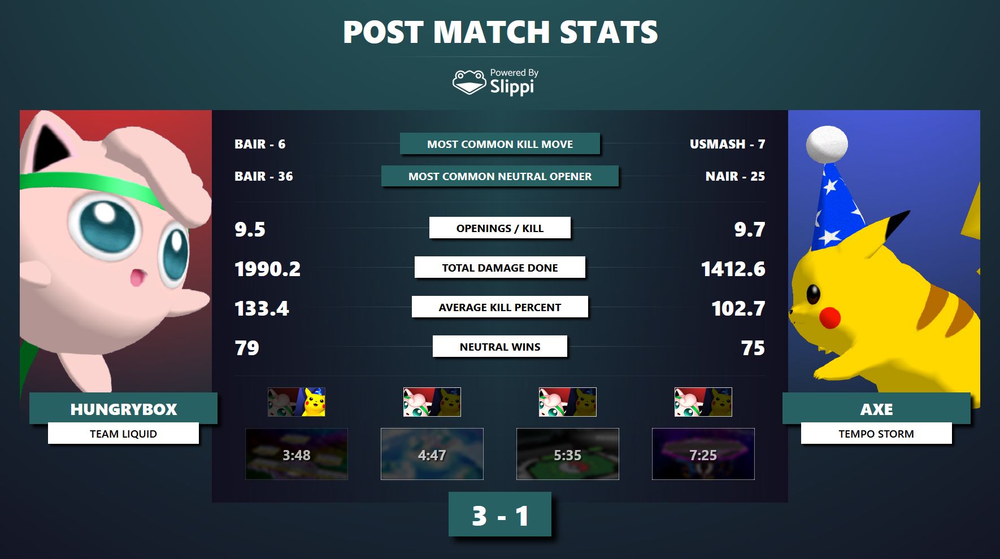
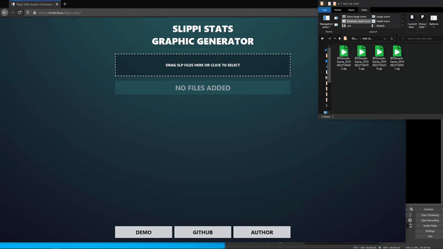

# Slippi Stats Graphic Generator

> Automatically generate Summit-style Slippi set stats. Say that 5 times.

Instantly compute Slippi stats in-browser and beautifully render the results. Perfect for both tournament broadcasts and competitors.

## Screenshot



## Features

- Extremely fast offline stats computation
- Easy drag-and-drop into OBS
- Highly customizable
- No download required
- Free and open source

## Usage

1. Go to <https://vinceau.github.io/slippi-stats/>
2. Drag and drop your SLP files
3. Click "Generate Stats"
4. Drag the OBS button into OBS to instantly create a source



## FAQ

### The detected winner is incorrect!

Determining who wins a game seems easy at first but once you consider the possibilities of LRAS and quitting out of games, it's actually non-trivial. If the detected winner is incorrect, you can fix the set count by clicking on the head-to-head images.


### Can I remove the background in OBS?

Yes, you can! Just add this to the Custom CSS in the source properties.

```css
body {
  background: none !important;
}
```

### Can I change the color scheme?

Yes, you can! Expand the options panel at the bottom to show some more customization options.


### How does it work?

It reads your SLP files locally and does all the computation in-browser. Nothing is sent to any servers so this works offline too! This allows very fast Slippi game parsing so you can generate these graphics instantly.

## Development

In the project directory, you can run:

```
yarn run start
```

This runs the app in the development mode. Open <http://localhost:3000> to view it in the browser. The page will reload as you make changes.

To build the app for production, run:

```
yarn run build
```

## Acknowledgements

This project was made possible by:

- [Jas Laferriere](https://github.com/JLaferri) and the rest of the [Project Slippi](https://slippi.gg/about) team for Project Slippi

- [Jas Laferriere](https://github.com/JLaferri) for his [Slippi Set Stats](https://github.com/project-slippi/slippi-set-stats) script

- [BTS Smash](https://twitter.com/BTSsmash/) for their post-match stats design

## License

This software is released under the terms of [MIT license](LICENSE).
